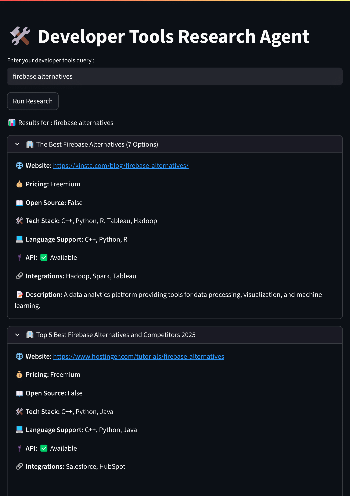

# Developer Tools Research Agent

## 📌 Overview

The **Developer Tools Research Agent** is an AI-powered application that searches, analyzes, and recommends developer tools using web scraping and a Large Language Model (LLM). The system leverages a multi-step workflow to:

1. Search for relevant tools based on a query.
2. Extract tool names from relevant articles.
3. Research each tool's website for technical and business details.
4. Provide summarized recommendations.

The project is built with **LangGraph**, **LangChain**, **Firecrawl**, and a custom workflow class.

---

## 🚀 Features

* 🔍 **Tool Discovery**: Finds relevant tools from the web.
* 📄 **Content Extraction**: Scrapes official pages for details.
* 🧠 **AI-Powered Analysis**: Extracts structured data (pricing, tech stack, API availability, etc.).
* 💡 **Recommendations**: Summarizes findings for decision-making.
* 🌐 **Streamlit UI**: Interactive interface replacing the console version.

---

## 🛠️ Tech Stack

* **Python 3.9+**
* [LangGraph](https://python.langchain.com/docs/langgraph)
* [LangChain](https://www.langchain.com/)
* [Firecrawl](https://www.firecrawl.dev/)
* [Streamlit](https://streamlit.io/)
* Deep Seek-compatible LLM API (via TogetherAI)

---

## 📂 Project Structure

```
.
├── src/
│   ├── workflow.py         # Main workflow logic
│   ├── firecrawl.py        # Firecrawl service wrapper
│   ├── prompts.py          # Prompt templates
│   └── models.py           # Pydantic models for data
├── app.py                  # Streamlit UI
├── requirements.txt        # Dependencies
├── .env                    # Environment variables
├── screenshots/            # Example output screenshot
└── README.md               # This file
```

---

## ⚙️ Installation

```bash
git clone git@github.com:ourahma/git@github.com:ourahma/Web-Search-AI-Agent.git.git
cd Web-Search-AI-Agent
pip install -r requirements.txt
```

Create a `.env` file with your API keys:

```env
TOGETHER_API_KEY=your_api_key_here
FIRECRAWL_API_KEY=your_api_key_here
```

---

## 💻 Usage

Run the Streamlit UI:

```bash
streamlit run app.py
```

Enter a developer tools query and view structured results with recommendations.

---

## 📊 Example Results

Below is an example of the results interface:




---

## ✍️ Author

**OURAHMA Maroua**
